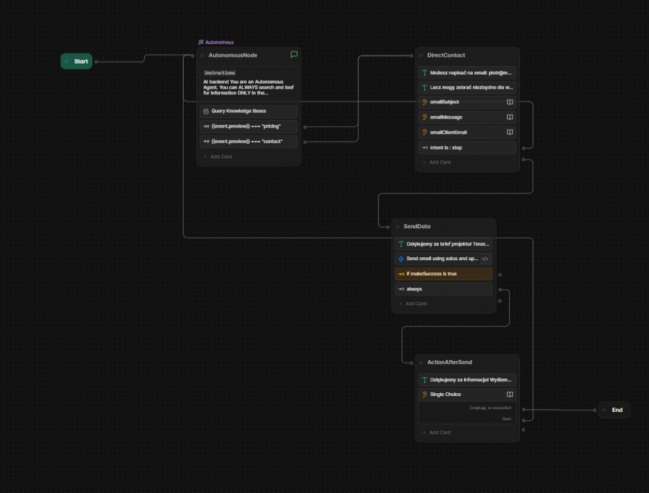

# Botpress Conversational AI Assistant with Lead Automation
This repository contains a Conversational AI Assistant built with Botpress and integrated with Make.com for lead generation and automation. The assistant can autonomously answer customer inquiries, provide contact information, and generate leads, which are then transferred to a custom CRM. This setup is ideal for businesses seeking automated customer interaction, contact management, and streamlined lead processing.

**Overview**
The Botpress Conversational AI Assistant leverages Botpress for building conversational flows and Make.com for CRM integration, enabling efficient automation of lead generation. This assistant operates autonomously, capturing essential information, guiding customers with pre-defined paths, and sending lead data to any custom CRM via Make.

**Key Features**

Autonomous Interaction:
Uses Botpress to autonomously guide users through common inquiries such as pricing, contact information, and more.
Designed to detect specific intents like "contact" or "pricing" to provide tailored responses.
Automated Lead Generation:

Captures customer information and creates leads based on predefined triggers.
Uses Make.com for lead transfer to a custom CRM, ensuring smooth data handling and follow-up.
Customizable Integration:

Highly flexible integration with Make.com allows for easy adaptation to various CRM systems.
All lead data is transferred in real-time, facilitating prompt sales actions.

**Workflow**
1. Start Node
The assistant initiates the conversation by greeting the user and determining the intent behind their inquiry. The assistant is capable of handling questions autonomously, with instructions to act as a self-guided agent.
2. Autonomous Node
Intent Detection: Detects specific keywords such as "pricing" and "contact" within the user's message.
Knowledge Base Queries: Responds to questions by querying internal knowledge bases for answers related to pricing or contact details.
Routes the conversation based on detected intent, either to provide contact info or initiate a lead-capturing process.
3. Direct Contact
Email Prompt: Offers users the option to reach out directly via email.
Email Details Capture: Collects essential information such as email subject, message, and client's email, if the user chooses direct contact.
Stop Intent: Ends the interaction if the user decides to stop at this stage.
4. Send Data to CRM
Lead Submission: After capturing user information, the assistant sends the lead data to the CRM via Make.com if a "lead" is successfully identified.
Success Check: Confirms that the data was successfully sent to the CRM.
Sends an acknowledgment message to the user if the data transfer is successful.
5. Action After Send
Confirmation Message: Sends a follow-up message thanking the user for the interaction and confirming receipt of their details.
End of Conversation: Ends the interaction once the confirmation message has been sent.

**Project Structure**
Botpress Project: Contains the main conversational flow, including the autonomous query node, direct contact capture, and lead submission nodes.
Make.com Integration: Manages lead transfer from Botpress to the CRM, ensuring real-time lead processing.
